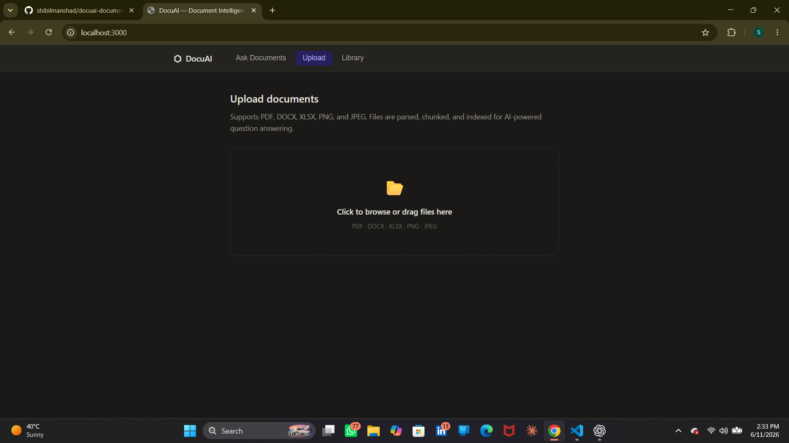
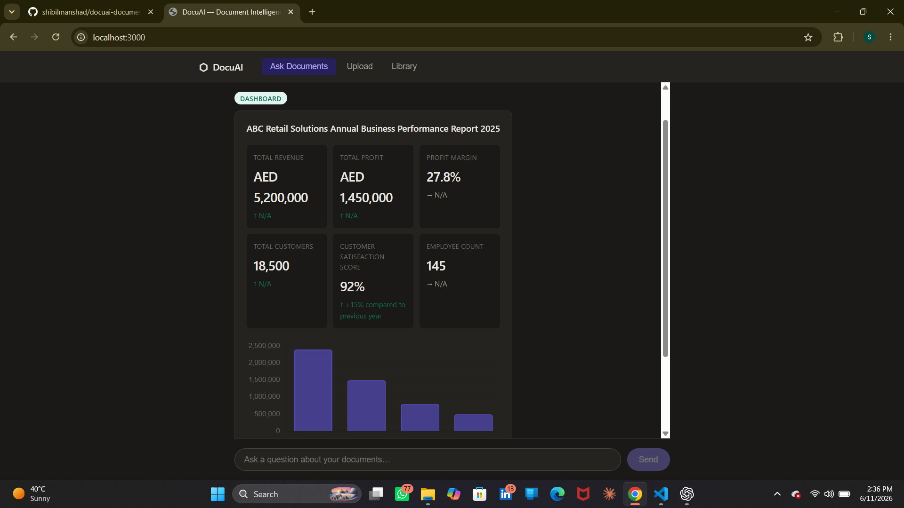
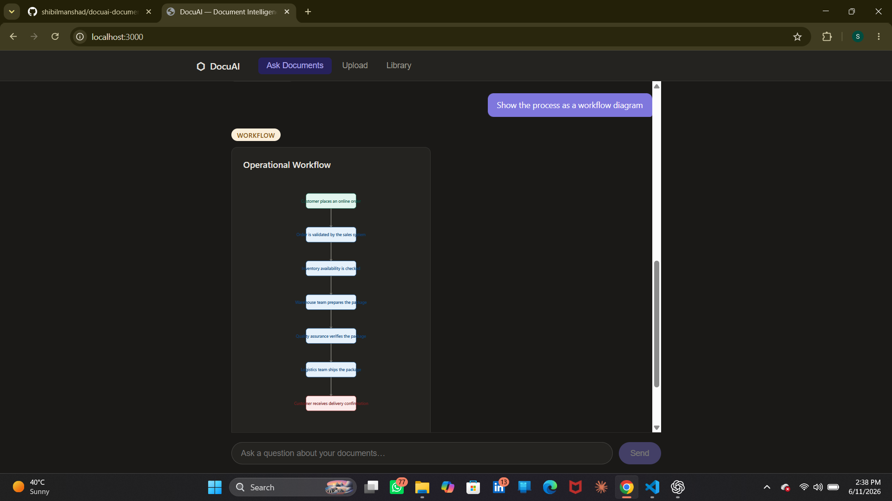
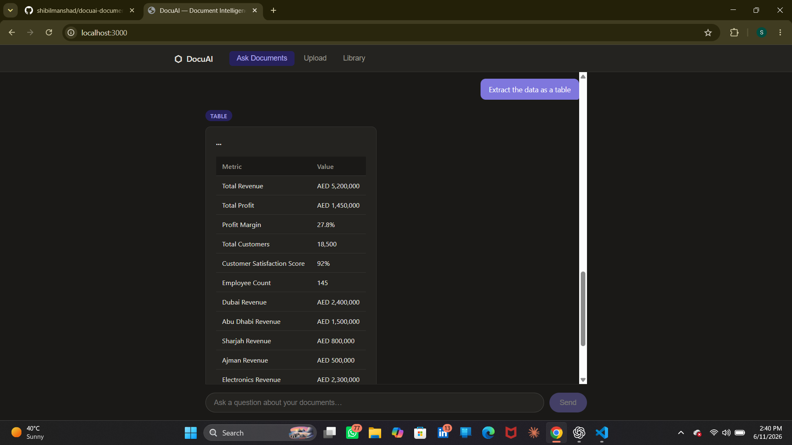

# DocuAI — AI-Powered Document Intelligence Platform with RAG and Generative UI

DocuAI is a full-stack AI-powered Document Intelligence Platform that combines Retrieval-Augmented Generation (RAG) with Generative UI. Users can upload PDFs, DOCX files, Excel spreadsheets, and images, then interact with documents through natural language to dynamically generate answers, dashboards, structured tables, and workflow diagrams.

**Fully local and free.** Uses Ollama + Llama 3 for LLM inference and local Sentence Transformers embeddings. No OpenAI API key required.

---

## AI Features

* Retrieval-Augmented Generation (RAG)
* Generative UI
* Semantic Search
* OCR for scanned documents and images
* Multi-format document ingestion
* Dashboard Generation
* Workflow Generation
* Table Generation
* Conversational Document Q&A
* Source Citations

---

## Tech Stack

| Component            | Technology                             |
| -------------------- | -------------------------------------- |
| OCR                  | pytesseract                            |
| Embeddings           | sentence-transformers/all-MiniLM-L6-v2 |
| Vector Database      | ChromaDB                               |
| RAG Pipeline         | LangChain                              |
| Backend API          | FastAPI                                |
| Frontend             | React + Vite                           |
| LLM                  | Ollama + Llama 3                       |
| Generative UI        | Dynamic React Widgets                  |
| Dashboard Generation | Llama 3                                |
| Workflow Generation  | Llama 3                                |
| Table Generation     | Llama 3                                |

---

## Architecture

```text
Documents (PDF, DOCX, XLSX, Images)
         │
   ┌─────▼────────────────────────────┐
   │   Document Parser (ingest.py)    │
   │   PDF · OCR · Table Extraction   │
   └─────┬────────────────────────────┘
         │
   ┌─────▼──────────────────┐
   │ RecursiveTextSplitter  │
   │     Chunking Engine    │
   └─────┬──────────────────┘
         │
   ┌─────▼──────────────────────────┐
   │ HuggingFace Embeddings         │
   │ all-MiniLM-L6-v2              │
   └─────┬──────────────────────────┘
         │
   ┌─────▼──────────────────┐
   │ ChromaDB Vector Store  │
   └─────┬──────────────────┘
         │
   ┌─────▼──────────────────────────┐
   │ Intent Router (rag.py)         │
   │ QA · Dashboard · Table         │
   │ Workflow Generation            │
   └─────┬──────────────────────────┘
         │
   ┌─────▼──────────────────────────┐
   │ Ollama + Llama 3              │
   └─────┬──────────────────────────┘
         │
   ┌─────▼──────────────────────────┐
   │ FastAPI Backend                │
   │ /upload · /query · /documents  │
   └─────┬──────────────────────────┘
         │
   ┌─────▼──────────────────────────┐
   │ React Frontend                 │
   │ Generative UI                  │
   │ DashboardWidget                │
   │ WorkflowWidget                 │
   │ TableWidget                    │
   └────────────────────────────────┘
```

---

## Generative UI

Unlike traditional chatbots, DocuAI dynamically changes the interface based on user intent.

Examples:

**Question Answering**

```text
What is this document about?
```

→ Returns a contextual answer.

**Dashboard Generation**

```text
Give me a dashboard of key metrics.
```

→ Generates KPI cards and charts.

**Table Generation**

```text
Extract the data as a table.
```

→ Produces structured tabular data.

**Workflow Generation**

```text
Show the process as a workflow diagram.
```

→ Generates workflow nodes and connections.

---

## Screenshots

### Document Upload



### Generative Dashboard



### Workflow Diagram



### Structured Table Extraction



---

## Quick Start

### Prerequisites

Install Ollama and download Llama 3:

```bash
ollama pull llama3
```

---

### Clone Repository

```bash
git clone https://github.com/shibilmanshad/docuai-document-intelligence.git
cd docuai-document-intelligence
```

---

### Backend Setup

```bash
cd backend

python -m venv venv

# Windows
venv\Scripts\activate

pip install -r ../requirements.txt

uvicorn app:app --reload
```

Backend runs on:

```text
http://localhost:8000
```

---

### Frontend Setup

Open a second terminal:

```bash
cd frontend

npm install

npm run dev
```

Frontend runs on:

```text
http://localhost:3000
```

---

### Start Ollama

Open another terminal:

```bash
ollama serve
```

---

## API Endpoints

### Upload Document

```http
POST /upload
```

Upload PDF, DOCX, XLSX, or image files.

---

### Query Documents

```http
POST /query
```

Example:

```json
{
  "question": "What is the total revenue?"
}
```

---

### List Documents

```http
GET /documents
```

---

### Delete Document

```http
DELETE /documents/{filename}
```

---

## Implemented Features

* ✅ Document Upload
* ✅ PDF Processing
* ✅ DOCX Processing
* ✅ Excel Processing
* ✅ OCR Extraction
* ✅ Local Embeddings
* ✅ ChromaDB Vector Search
* ✅ Retrieval-Augmented Generation (RAG)
* ✅ Generative Dashboard UI
* ✅ Workflow Diagram Generation
* ✅ Structured Table Generation
* ✅ Source Citations
* ✅ Conversational Memory
* ✅ FastAPI Backend
* ✅ React Frontend
* ✅ Ollama Integration
* ✅ Fully Local Deployment

---

## Future Improvements

* Interactive React Flow workflows
* Multi-document comparison
* User authentication
* Document summarization
* Advanced analytics dashboards
* Hybrid retrieval (BM25 + Vector Search)
* Multi-user workspace support

---

## Author

**Shibil Manshad**

AI & Data Science Graduate | Generative AI | RAG | AI Automation | Data Analytics

GitHub: https://github.com/shibilmanshad
